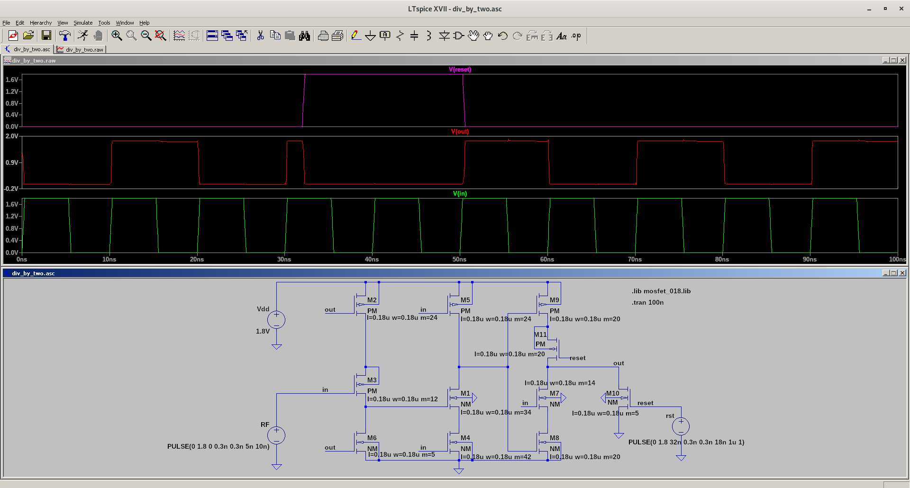

# div_by_two
A divide-by-two circuit quoted from Chapter 8 of the book "Low power CMOS circuits : technology logic design and CAD tools" by Christian Piguet

This divider circuit is just a three-stage master-slave flip-flop using [TSPC logic](http://www.seas.ucla.edu/brweb/papers/Journals/BRFall16TSPC.pdf#page=3)

