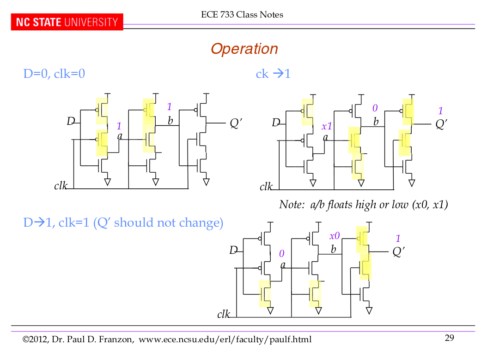
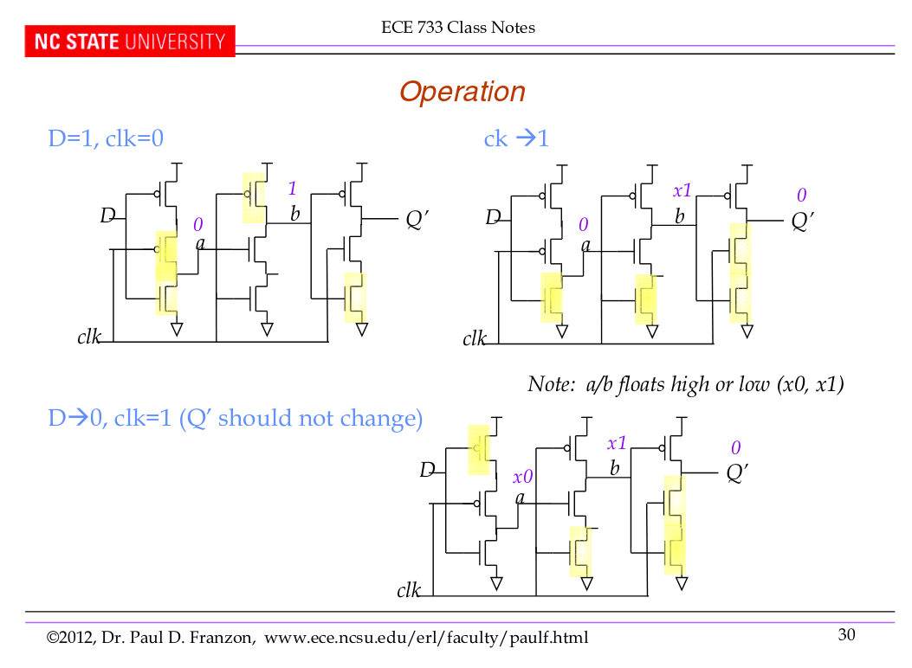

# div_by_two
A divide-by-two circuit quoted from Chapter 8 of the book "Low power CMOS circuits : technology logic design and CAD tools" by Christian Piguet

This divider circuit is just a positive-edge triggered D flip-flop of [TSPC logic](http://www.seas.ucla.edu/brweb/papers/Journals/BRFall16TSPC.pdf#page=3) with Q_bar connected in loopback to D input.

*initial D = 0*

*initial D = 1*

TODO

* Improves the D flip flop to use [split output latches](https://i.imgur.com/b1hWxbX.png) design which has lesser mosfet and clock loadng.

* Current D flip flop does not support **asynchronous reset**
